# 💎 **Core Principles of Network Architecture**

This guide provides a comprehensive overview of designing an optimal network architecture, a foundational requirement for any modern organization.

<strong>📑 Table of Contents</strong>

### 🎯 Core Principles
- [💡 The Importance of Network Architecture](#-the-importance-of-network-architecture)
- [🚦 Common Network Performance Challenges](#-common-network-performance-challenges)
  - [Congestion](#congestion)
  - [High Latency 🐢](#high-latency-)
  - [The Critical Relationship 🔗](#the-critical-relationship-)
- [🛠️ The Four Pillars of Network Design](#️-the-four-pillars-of-network-design)
  - [1. Fault Tolerance and Redundancy 🛡️](#1-fault-tolerance-and-redundancy-️)
  - [2. Scalability 🚀](#2-scalability-)
  - [3. Security 🔒](#3-security-)
  - [4. Quality of Service (QoS) 🎯](#4-quality-of-service-qos-)

### 🏗️ Network Architectures
- [🚀 Cisco's 3-Tier Network Architecture](#-ciscos-3-tier-network-architecture)
  - [🏛️ The Layers of the 3-Tier Architecture](#️-the-layers-of-the-3-tier-architecture)
  - [📌 Key Takeaway: Layer 3 Switches](#-key-takeaway-layer-3-switches)
  - [🌟 3-Tier Architecture: A Deeper Look](#-3-tier-architecture-a-deeper-look)
  - [🛒 Switch Selection (Cisco Products)](#-switch-selection-cisco-products)
- [🚀 Cisco 2-Tier Architecture](#-cisco-2-tier-architecture)
  - [📊 Analyzing the 2-Tier Diagram](#-analyzing-the-2-tier-diagram)
  - [🛡️ Key Design Feature: Fault Tolerance](#️-key-design-feature-fault-tolerance)

### 🤖 Modern Networking Technologies
- [🚀 Understanding Software-Defined Networking (SDN)](#-understanding-software-defined-networking-sdn)
  - [🛠️ The Traditional Method](#️-the-traditional-method)
  - [🤖 Automation: A Better Alternative](#-automation-a-better-alternative)
  - [🔌 Cisco Zero Touch Provisioning (ZTP)](#-cisco-zero-touch-provisioning-ztp)
  - [🧠 Controller-Based Solutions: The Real Change](#-controller-based-solutions-the-real-change)
  - [🏗️ Components and Architecture of SDN](#️-components-and-architecture-of-sdn)

### 🏢 Data Center Design
- [🏛️ Data Center Architectures](#️-data-center-architectures)
  - [💰 Cost and Service Providers](#-cost-and-service-providers)
  - [🏢 Branch Office vs. On-Premises](#-branch-office-vs-on-premises)
  - [🏛️ Spine and Leaf Architecture](#️-spine-and-leaf-architecture-data-center-design)
- [📦 Storage Area Networks (SANs)](#-storage-area-networks-sans)
  - [⛔ The Problem of Lacking Centralized Storage](#-the-problem-of-lacking-centralized-storage)
  - [1️⃣ Solution 1: Network Attached Storage (NAS)](#1️⃣-solution-1-network-attached-storage-nas)
  - [2️⃣ Solution 2: Storage Area Network (SAN)](#2️⃣-solution-2-storage-area-network-san)
  - [⚡ High-Speed Connection Types in SANs](#-high-speed-connection-types-in-storage-area-networks-sans)

### ☁️ Cloud Computing
- [☁️ Fundamental Principles of Cloud Computing](#️-fundamental-principles-of-cloud-computing)
  - [💸 Pay-As-You-Go Model](#-pay-as-you-go-model)
  - [🚀 Advantages of Cloud Computing](#-advantages-of-cloud-computing)
  - [⚖️ Elasticity and Scalability](#️-elasticity-and-scalability)
  - [🔒 Security: A Shared Concern](#-security-a-shared-concern)
- [☁️ Cloud Deployment Models](#️-cloud-deployment-models)
  - [1. Private Cloud 🏢](#1-private-cloud-)
  - [2. Public Cloud 🌐](#2-public-cloud-)
  - [3. Hybrid Cloud 🔄](#3-hybrid-cloud-)
  - [4. Community Cloud 🤝](#4-community-cloud-)
- [📦 Cloud Service Models](#-cloud-service-models)
  - [1. SaaS (Software-as-a-Service) 📧](#1-saas-software-as-a-service-)
  - [2. PaaS (Platform-as-a-Service) 💻](#2-paas-platform-as-a-service-)
  - [3. IaaS (Infrastructure-as-a-Service) 🛠️](#3-iaas-infrastructure-as-a-service-️)
  - [4. DaaS (Desktop-as-a-Service) 🖥️](#4-daas-desktop-as-a-service-️)
  - [5. IaC (Infrastructure as Code) 📜](#5-iac-infrastructure-as-code-)
- [🔗 Cloud Connectivity Solutions](#-cloud-connectivity-solutions)
  - [1. VPN (Virtual Private Network) 🔒](#1-vpn-virtual-private-network-)
  - [2. Private-Direct Connection 🔌](#2-private-direct-connection-)

---

## 💡 The Importance of Network Architecture

Designing an optimal network architecture is a critical task for any organization. This process extends far beyond simply purchasing new cables and devices; it is fundamentally about establishing a correct and robust foundation for all network operations.

When an organization experiences issues like **network congestion**, **high latency** (slow speeds), and **security vulnerabilities**, the root cause is often a poor network design. If the foundational design is flawed, adding new or expensive devices will not resolve these underlying problems.

A high-quality design ensures the network delivers:

* **High Performance:** Data travels quickly and efficiently.
* **Robust Security:** The network is protected from cyberattacks.
* **Future Growth:** The network can expand to meet new demands.

---

## 🚦 Common Network Performance Challenges

Two of the most common issues stemming from poor design are congestion and latency.

### Congestion

**Congestion** occurs when a network link (such as a cable or path) attempts to handle more data (traffic) than it has the capacity for. This is identical to a traffic jam on a road during rush hour.

* **Cause:** Congestion happens when too many devices try to send data simultaneously, and the network devices (like routers and switches) cannot process this volume of data quickly enough.
* **Effect:** Congestion forces data packets to wait in a queue. This waiting period slows down packet speed, and in severe cases, some packets are **discarded** (lost). This process significantly reduces network reliability.

### High Latency 🐢

**Latency** is the total time it takes for a data packet to travel from its source to its destination and return (known as the **Round Trip Time**). When this time is excessive, it is called **High Latency**.

* **Cause:** The most significant cause of high latency is network congestion. When packets must wait in line due to traffic, their latency naturally increases. Other causes can include data traveling very long physical distances or failing network equipment.
* **Effect:** Users experience high latency as slow response times. For example:
    * Web pages take a long time to load.
    * Online games suffer from "lag" or stuttering.
    * Video calls freeze or buffer.

### The Critical Relationship 🔗

**Congestion is the primary cause of high latency.** When traffic on the network increases to the point of congestion, the resulting packet delays directly increase latency. Both of these issues are detrimental to achieving high network performance and a good Quality of Service (QoS).

---

## 🛠️ The Four Pillars of Network Design

When designing a network, you must consider four fundamental factors to prevent the issues above and build a robust system.

### 1. Fault Tolerance and Redundancy 🛡️

**Fault tolerance** is a principle ensuring that your network can continue to operate and provide services even if a component fails.

Its goal is to ensure that if any network device (like a router or switch) or a cable fails, the network can:
1.  Quickly identify the failure.
2.  Reroute traffic through an alternate path.

This prevents any interruption in communication for users and maintains high network **availability**.

Network professionals achieve fault tolerance by implementing **redundancy**.

* **What is Redundancy?** Redundancy simply means creating more than one path (multiple paths) for data packets to travel between a source and a destination.
* **How it Works:** If one path fails (e.g., a router goes offline ❌), the network devices immediately detect this failure. They then automatically reroute the traffic through the remaining healthy paths (as shown by the green arrow ➡️) to ensure the data still reaches its destination.

  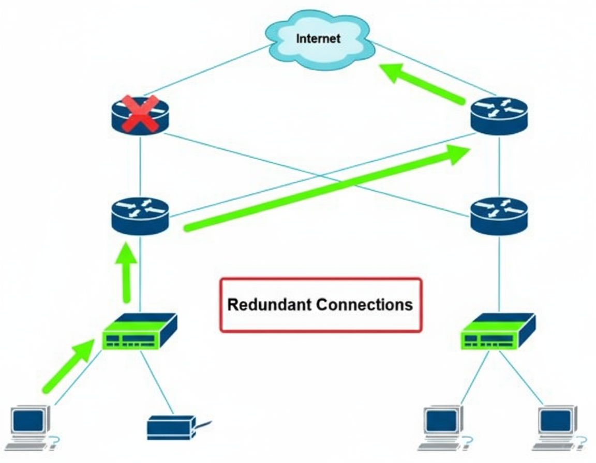

#### The Role of Packet Switching 📦

Most modern networks use **packet switching** to send data.

1.  **Message Division:** When you send a message (like an email), the sending device divides it into small pieces called **packets**.
2.  **Independent Travel:** Each packet contains the destination address. In a packet-switched network, it is not necessary for all packets to follow the same route.
3.  **Best Path:** Each packet can individually choose the best path available at that moment, based on current network conditions like traffic (congestion) and speed.

Fault tolerance and redundancy make packet switching even more effective. If one path fails, packets can instantly be routed to another available path, making the message delivery highly reliable.

### 2. Scalability 🚀

**Scalability** is a critical part of network design. It means designing the network in a way that allows it to easily support the organization's growth. This includes adding new devices, new users, and new applications without negatively impacting the network's performance.

As a company expands and hires new employees, the number of devices on the network (computers, laptops, smart devices) increases. Network professionals must add new switches to connect these devices.

If the original network design is not scalable, adding new devices will cause significant problems or degrade the performance of existing services.

#### The "Daisy Chain" Connection: A Non-Scalable Example ⛓️

A **daisy chain** is a method where devices are connected in a linear series: one switch is connected to the next, which is connected to the next, forming a long chain.

* **Function:** This method *does* provide end-to-end connectivity.
* **Problem:** This design is terrible for both scalability and redundancy.

**Disadvantages of Daisy-Chaining ⚠️**

1.  **Lack of Fault Tolerance:** If any single switch in the chain fails (especially one in the middle), all devices "downstream" from that switch will lose their network connection. The network becomes severely impacted by a single point of failure.
2.  **Performance Issues:** When traffic needs to travel from one end of the chain to the other, it must pass through every single intermediate switch. This long journey significantly increases latency and creates a high risk of congestion.

For these reasons, daisy-chaining switches is **not recommended** as it leads to long-term problems. A proper, scalable design, such as a **star topology** (where all switches connect to a central distribution switch), is preferred.

  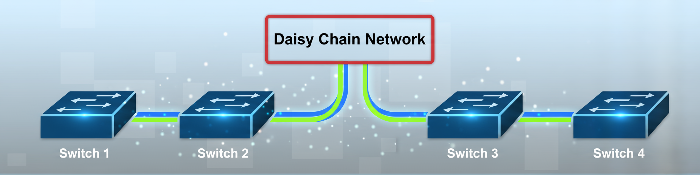

### 3. Security 🔒

Network security is the most critical priority for every organization today, regardless of its industry. With the rise of sophisticated cyberattacks, organizations must protect their data and assets from threats like hackers.

The fundamental goal of security in network design is to protect assets and **mitigate risks**. Without security solutions, network professionals might not even know *when* or *how* their network was compromised until it is too late.

Organizations must invest in a variety of layered security solutions:

* **Firewall Appliances:**
    * **Function:** A firewall acts as a door between the internal network and the outside world (the Internet).
    * **Purpose:** It filters data traffic, only allowing packets to enter or leave that comply with predefined security rules.
* **Intrusion Prevention Systems (IPSs):**
    * **Function:** An IPS continuously monitors all network traffic.
    * **Purpose:** If it detects any
        suspicious or malicious activity (an "intrusion"), it immediately blocks that activity to prevent any damage from occurring.
* **Endpoint Security Solutions:**
    * **Function:** These solutions are installed directly on each end device (e.g., computer, laptop, or server).
    * **Purpose:** They protect the individual devices from viruses, malware, and other local threats.

**Benefits of Investing in Security**

1.  **Rapid Detection:** It reduces the **"time to detect an intrusion."** The moment a hacker enters the network, the security system can identify and flag them.
2.  **Continuous Protection:** Security solutions are constantly evolving, providing cybersecurity professionals with the necessary tools to defend against new and emerging threats.

In simple terms, a strong network security design is like an insurance policy for the organization, protecting its business operations and data.

### 4. Quality of Service (QoS) 🎯

**Quality of Service (QoS)** is a technology that allows network professionals to give **priority** to specific types of data traffic. This ensures that essential services continue to function perfectly, even when the network is experiencing congestion.

Different types of data have different needs:

* **TCP (Transmission Control Protocol):** Most applications (like email and web browsing) use TCP because it provides **guaranteed delivery**. If a packet is dropped, TCP ensures it is sent again.
* **UDP (User Datagram Protocol):** Time-sensitive applications (like **VoIP - Voice over IP** and **Video over IP**) use UDP. It is much faster but does **not** guarantee delivery.

**The Problem:** During network congestion, UDP messages are the most likely to be dropped. Voice and video calls must happen in **real-time**. If their packets are dropped, parts of the conversation are simply lost, which destroys the user experience.

**The QoS Solution:** QoS mechanisms configure routers and switches to:
1.  **Identify** high-priority traffic (like VoIP and Video).
2.  **Reserve** bandwidth for that traffic.
3.  **Prioritize** it over other, less time-sensitive traffic (like file downloads or email).

This way, even during heavy network congestion, essential data reaches its destination quickly and with low latency.

---

# 🚀 **Cisco's 3-Tier Network Architecture**

Cisco's 3-Tier Architecture is a common and highly effective network design approach utilized by large organizations. In this design, the network is segmented into three distinct layers, with each layer performing a specific function. This design simplifies the network and makes it easier to manage.

---

## 🏛️ The Layers of the 3-Tier Architecture

  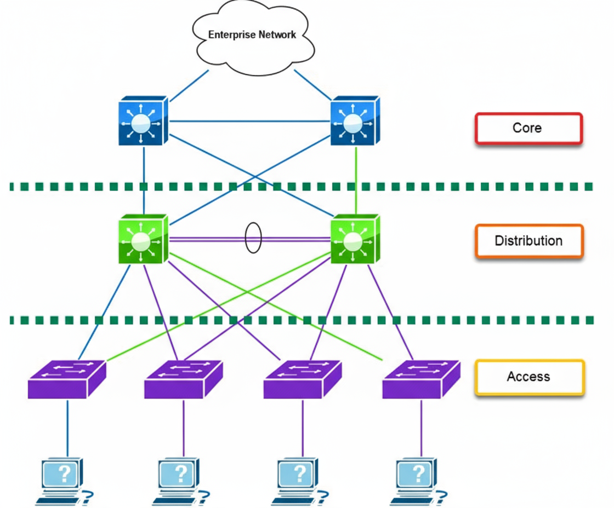

This architecture enhances scalability, fault tolerance, and security by separating the three layers.

### 1. Access Layer (Edge Layer) 🔌

* **Objective**: This layer connects end devices (such as computers and printers) to the network. It represents the "edge" of the network where users begin to access data.
* **Function**: It primarily operates at **Layer 2** (of the OSI Model), meaning it forwards data frames based on MAC addresses.
* **Redundancy**: Typically, end devices (like computers) have only one Network Interface Card (NIC). Therefore, their connectivity to the Access Layer switch usually does not include redundancy.

### 2. Distribution Layer (Aggregation Layer) 🔗

* **Objective**: This layer connects the Access Layer switches and provides redundancy for them. It aggregates the traffic received from the access layer and forwards it to the Core Layer.
* **Function**: It possesses **Layer 3** (Routing) capabilities. **Layer 3 Switches** are used at this layer, which perform routing (sending traffic between different subnets) and filtering (using access lists).
* **Redundancy**: Each Access Layer switch is connected to two different Distribution Layer switches. If one Distribution switch fails, the Access switch immediately redirects traffic to the other switch, thus maintaining fault tolerance.

### 3. Core Layer (Backbone) 🧠

* **Objective**: This is the backbone of the network. Its fundamental purpose is to transport data at high speeds.
* **Function**: Core Layer switches focus solely on high-speed switching and routing. They do not perform any complex filtering or policy enforcement. They are designed using **Layer 3 Switches**.
* **Traffic Flow**: All traffic coming from the Distribution Layer passes through the Core Layer to reach the Enterprise Network or other branches.

---

## 📌 Key Takeaway: Layer 3 Switches

It is essential to remember that **Layer 3 switches** are used in the Distribution and Core Layers. These switches can perform both Layer 2 (switching) and Layer 3 (routing) functions. This makes it easy to segment the network into different subnets and rapidly route traffic between them.

---

## 🌟 3-Tier Architecture: A Deeper Look

Cisco's 3-Tier Architecture provides a foundation that offers large organizations excellent scalability, fault tolerance, and redundancy. In this design, the network is divided into three separate layers, which is also known as a **modular design**.

  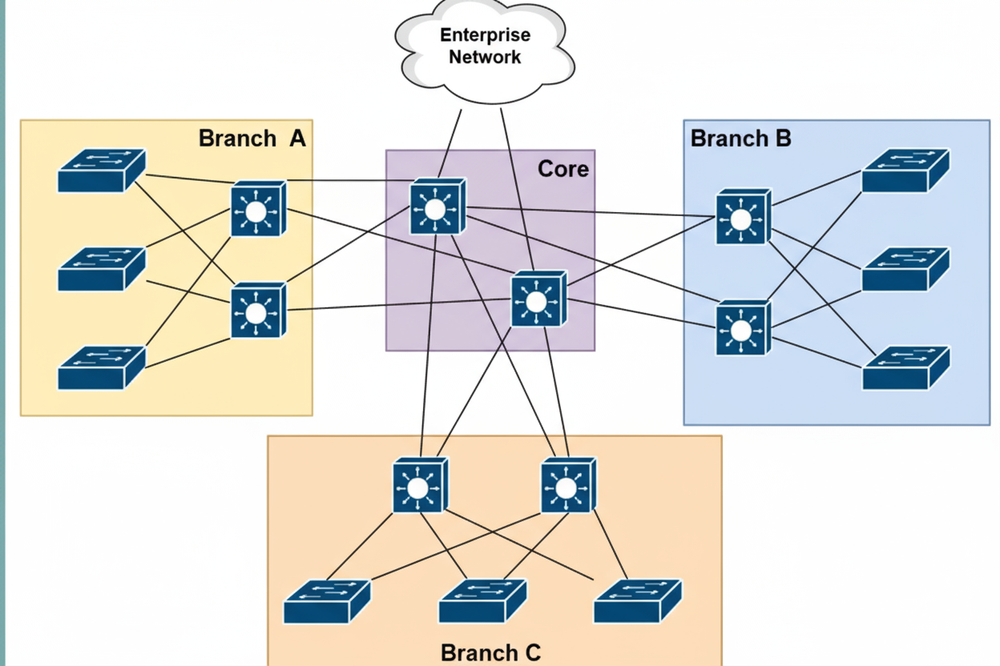

### Core Layer (Network Backbone) 🧠

The Core Layer is the high-speed backbone of the network architecture.

* **Objective**: Its primary role is to transport data at high speeds and provide interconnectivity and redundancy for the distribution layers.
* **Function**: When traffic needs to be sent from one Branch Office to another (e.g., from Branch A to Branch B), that data passes through the Core Layer.
* **Redundancy**: Every Distribution Layer switch is connected to every switch in the Core Layer. This ensures that if a single switch or link in the Core Layer fails, traffic can immediately travel via an alternative path.

### Benefits of 3-Tier Architecture ✅

This architecture is ideal for large organizations because:

* **Modular Design**: The design is segmented into three layers. Each layer has its specific role, which maintains scalability (new devices can be added easily) and redundancy.
* **Consistency**: This design supports modularity, which makes it easy to replicate design elements and implement them across the entire organization.
* **Flat-Network Elimination**: It eliminates the old and weak flat-network design, which supports neither scalability nor redundancy.

---

## 🛒 Switch Selection (Cisco Products)

Since the functions of each layer are different, selecting the appropriate switch model for each layer is crucial.

* **Access Layer Switches (LAN Access)**: These switches are for connecting end devices.
    * *Examples*: Catalyst 9200/9300 Series.
* **Core and Distribution Layer Switches (LAN Core and Distribution)**: These are high-speed and high-redundancy switches.
    * *Examples*: Catalyst 9500/9600 Series.

**💡 Tip**: As a network professional, you should always visit the vendor's website (like Cisco) to read the datasheet. This helps you understand if a specific switch model (like the Nexus 9000 Series, which is for data centers) meets your network's requirements and feature needs.

---

## 🏢 2-Tier Architecture

While the 3-Tier Architecture is recommended for large organizations, it can be quite expensive for smaller organizations. Therefore, the **2-Tier Architecture** was designed for smaller organizations.

This design provides features similar to the 3-Tier Architecture (scalability, fault tolerance) but **combines the Distribution and Core Layers** to reduce costs.

---

# 🚀 **Cisco 2-Tier Architecture**

The 2-Tier architecture is a network design tailored for **smaller organizations** that operate with a smaller network and budget.

This architecture consists of two layers instead of the traditional three. The 2-tier model provides the same essential benefits as the 3-tier model, including support for:

* Scalability
* Fault Tolerance and Redundancy
* Security
* QoS (Quality of Service)

...all within a more compact and cost-effective design.

---

  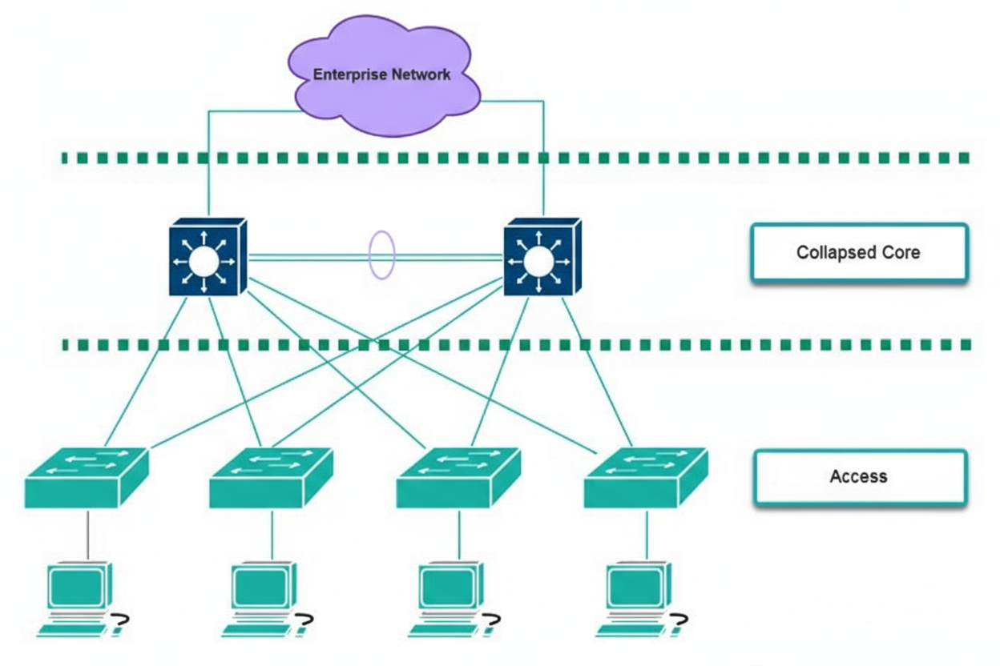

## 📊 Analyzing the 2-Tier Diagram (Figure 7.6)

The provided diagram clearly illustrates the 2-tier architecture, which is composed of a **Collapsed Core Layer** and an **Access Layer**.

### 1. The Collapsed Core Layer 🧠

* **Definition**: This layer is a **consolidation** of the **Core** and **Distribution** layers (from the 3-tier model) into a single, combined layer.
* **Implementation**: Network professionals can typically implement either Core or Distribution layer switches within this collapsed layer to handle the combined responsibilities.
* **Function**: As shown in the diagram, this layer connects to the wider "Enterprise Network" (like the internet or a WAN) and also aggregates all connections from the Access Layer. The two switches in this layer are also interconnected, providing a redundant link between them.

### 2. The Access Layer 💻

* **Function**: This layer remains the same as in the 3-tier model. Its functionality is to provide network connectivity for **end devices** (like computers, printers, and phones) to the actual network.
* **In the Diagram**: You can see the end-user computers connecting directly to their respective Access Layer switches.

---

## 🛡️ Key Design Feature: Fault Tolerance

A critical point to keep in mind is the high-availability connection strategy:

* As shown in the diagram, **each Access Layer switch is connected to *each* switch within the Collapsed Core layer.**
* This dual-connection design is intentional. It provides **fault tolerance** and **redundancy**. If one of the Collapsed Core switches fails, all Access Layer switches still have an active path to the network through the second, operational Collapsed Core switch.

---

# 🚀 Understanding Software-Defined Networking (SDN)

Software-Defined Networking (SDN) is a technology that permits network professionals to automate the configuration and management of an entire organization's networking devices using a controller-based solution (a central software).

---

## 🛠️ The Traditional Method

Traditionally, a network professional had to perform all of the following tasks manually:

* Purchasing networking devices (routers, switches) from a vendor (like Cisco).
* Unboxing each device.
* Upgrading the Operating System (OS) and firmware.
* Applying configurations by accessing each networking device separately.
* Finally, verifying that the configurations are working exactly as intended.

This method was considered completely normal because it has been the standard practice in the networking industry for years.

### Downsides of the Traditional Method 👎

The disadvantages of using this old method are:

* **Repetitive Work**: Many tasks are repeated over and over.
* **Time-Consuming**: This work requires a significant amount of time.
* **Manual Configuration**: The network professional must configure every switch and router by hand.
* **Human Errors**: Whenever a task is done manually, there is a possibility of human error. For example, accidentally misconfiguring features or services.

Many seasoned network professionals avoid this problem by creating templates (pre-defined sets of configuration) that are specific to certain devices.

However, even these templates can have issues, such as:

* They might be outdated.
* They might be applied to the wrong device models.

---

## 🤖 Automation: A Better Alternative

A better alternative to the traditional method is to use programming techniques to automate the process of applying configurations to devices on a TCP/IP network.

Network professionals can create scripts (small programs) using **Python** (a high-level programming language). These scripts gather information about networking devices from various sources (like Microsoft Excel workbooks or network monitoring applications).

This information includes:

* Hostnames
* IP Addresses
* Subnet Masks, etc.

Additionally, a template engine for Python, such as **Jinja2**, is used. Jinja2 allows network professionals to create templates that automate the process of applying configurations to networking devices.

### 💡 Tip (Advice)

To learn more about Jinja, check these links:

* [https://palletsprojects.com/p/jinja/](https://palletsprojects.com/p/jinja/)
* [https://jinja.palletsprojects.com/](https://jinja.palletsprojects.com/)

---

## 🔌 Cisco Zero Touch Provisioning (ZTP)

In a Cisco environment, **Zero Touch Provisioning (ZTP)** is a feature that gives network professionals the ability to configure a new networking device (like a new Cisco switch or router) in such a way that as soon as it is connected to the network, it **automatically** retrieves its configuration.

This saves a lot of time and significantly reduces the risk of misconfiguration on new networking devices.

## 🧠 Controller-Based Solutions: The Real Change

While these methods (Python scripts and ZTP) are much better than manual configuration, they still involve a lot of manual work that you might not realize.

The network engineering industry is now rapidly moving towards **controller-based solutions**. These solutions allow network professionals to manage the entire network from a single place (a **single pane of glass**, or one central dashboard).

Therefore, network professionals no longer need to manually apply configurations to network devices.

They simply state their **intent** (i.e., their objective) to the **SDN Controller**, and the controller itself applies all the necessary configurations across the network.

This new method is called **Intent-Based Networking (IBN)**.

---

## 🏗️ Components and Architecture of SDN

### 1. Traditional Network Architecture

In a common or traditional network, each networking device (like a router or switch) decides on its own how to send data to its destination.

In simple terms, every network device has its own "brain" that makes decisions for forwarding messages and has its own separate configurations.

Since devices on a traditional network operate autonomously (independently) from each other, it is very important to understand the role of the three (3) "planes" present inside each device:

* Management Plane
* Data Plane
* Control Plane

### 2. The Three Planes of a Network

In every traditional router or switch, these three planes work together:

#### 🧠 Management Plane
This plane allows network professionals to manage network devices. It uses various communication channels and protocols.

* **Protocols**: This includes Secure Shell (SSH), HTTPS, and Simple Network Management Protocol (SNMP).
* **Objective**: If a device did not have a management plane, it would be very difficult to manage or monitor it on the network. This is the path through which a human (admin) communicates with the device.

#### 🚛 Data Plane (Data Forwarding Plane)
The job of the data plane on a network device is to receive and forward messages between the source and the destination. This plane does the actual "hard work."

* **In a Switch**: When a switch receives a message (frame), it checks the destination MAC address inside the frame header. The switch then looks in its CAM Table (or MAC address table) to determine how to forward this frame to its destination.
* **In a Router**: A router checks the destination IP address inside the packet header and finds a suitable path in its local routing table to forward the packet to its destination.

#### 🧭 Control Plane (Decision-Making Plane)
The control plane on a network device controls how the entire device will operate.

* **The Real Brain**: The control plane is the actual "brain" of the device and it tells the device how to make forwarding decisions on the network.
* **Functions**:
    * Routing protocols (like OSPF or BGP) help routers decide how to send a packet to its destination.
    * Switches use Layer 2 forwarding algorithms (like Spanning Tree Protocol) to decide how to send a frame to the destination host.
* **Summary**: All the algorithms and mechanisms that decide how the device will handle messages are present within the control plane.

### 3. SDN Architecture (The New Method)

In an SDN architecture, the traditional method is completely changed.

* **Central Brain**: The **SDN controller** manages the role and function of the control plane for all networking devices.
* **The Big Change**: In simple terms, the individual control plane (brain) is removed from each network device. Now, this "brain function" is centrally controlled and managed by the SDN Controller.

  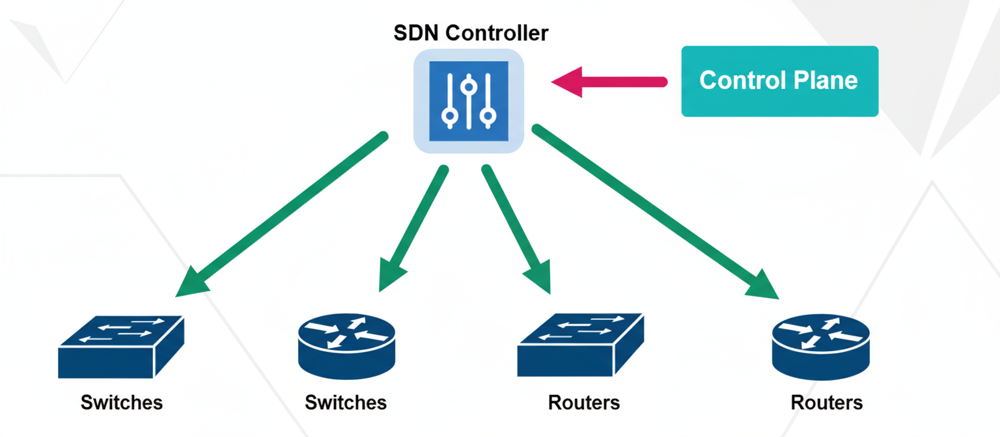

As shown in the diagram below (Figure 7.7):

**Figure 7.7 – SDN architecture**

In this diagram, the SDN Controller is at the very top (the central brain) and it is controlling all the switches and routers below it. Now, the devices do not have their own brains; they only perform the Data Plane's job based on the "instructions" from the Controller.

### 4. Benefits of SDN ✅

Using SDN in a large network provides many benefits to network professionals:

* **Complete Visibility**: The network professional simply logs into the SDN controller, which provides them complete visibility (the ability to see everything) over their network (such as network health and device performance).
* **Proactive Management**: The SDN controller can predict potential upcoming issues in the network and can also provide recommendations to resolve them.
* **Central Management**: Network professionals can centrally manage all networking devices across their entire organization from one place, through a single dashboard interface.

### 5. SDN APIs: How It Works? 🔌

The SDN controller manages all networking devices using the **Southbound Interface (SBI) API**.

#### Southbound Interface (SBI)
This is the means by which the Controller talks "down" (south) to the network devices (switches/routers). The following methods are used for this:

* NETCONF
* OpenFlow
* Command-line interface (CLI)
* SNMP
* OpFlex

Additionally, the network professional accesses the SDN controller via the **Northbound Interface (NBI) API**.

#### Northbound Interface (NBI)
This is the means by which a human (admin) or another program accesses the Controller from "above" (north). This interface provides you the "single pane of glass" (a single dashboard) from which the entire network is visible.

* **Access**: Practically, network professionals access the controller in two ways:
    1.  **Graphical User Interface (GUI)**: A visual dashboard (like the image of Cisco DNA Center below).
    2.  **Representational State Transfer (REST) API**: For retrieving information via automation scripts (like Python).

### 6. Example: Cisco DNA Center

The screenshot below shows the user interface (dashboard) of the **Cisco Digital Network Architecture (DNA) Center**.

  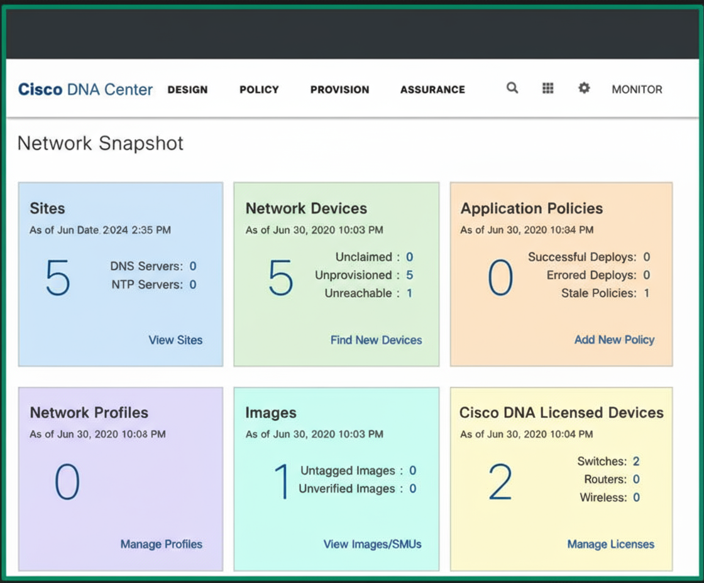

**Figure 7.8 – Cisco DNA Center**

Cisco DNA Center is, in fact, an SDN controller.

It allows network professionals to:

* Design the network and implement policies.
* Perform device provisioning tasks (i.e., quickly set up new devices on the network).
* Continuously monitor their network for performance issues.

---

# 🏛️ **Data Center Architectures**

A data center is a dedicated building or a group of buildings that houses a very large collection of servers, networking devices, and security appliances, which are maintained by an organization.

Medium and large organizations build data centers to allow IT professionals to keep all their servers and necessary applications within a dedicated space on their network. This concept provides two things:

1.  **Centralized Management**: Everything is managed from one location.
2.  **Dedicated Facility**: A place with proper environmental controls, such as:
    * **HVAC Systems**: Heating, Ventilation, and Air Conditioning (to keep the environment cool and suitable).
    * **Multiple Internet Connections**: From various Internet Service Providers (ISPs) (so if one goes down, the other remains active).
    * **Redundant Power Supplies**: Additional power arrangements (UPS, generators) to ensure the organization's critical resources are always available.

---

## 💰 Cost and Service Providers

While owning a data center is a splendid idea, building and maintaining one is very costly.

The alternative to this is that there are service providers (companies) that are building and maintaining data centers so that customers (other companies) can simply rent or lease the resources within those data centers.

For example, if your organization needs a few servers to host its essential applications and resources, but you do not have the physical space to store the servers, you can easily have your servers placed in a service provider's data center.

Now, we will look at the difference between branch and on-premises solutions.

---

## 🏢 Branch Office vs. On-Premises

Why does an organization need a data center? Organizations use servers to host their mission-critical applications (apps without which work cannot proceed), provide services, and store large amounts of data.

As productivity increases and new applications are needed, the IT team installs additional servers to ensure all users can easily access resources when needed.

### Instance:

If an organization has one (1) file server that provides centralized storage to hundreds of users on the network, that server will become overwhelmed as more users try to transfer files between their computers and that file server. In simple terms, the server has to handle every user's request at the same time, which uses a lot of computing power.

Furthermore, if that server becomes unavailable on the network, users will not be able to access the files stored on it.

### The Redundancy Solution

One solution is to install redundant servers within the organization, so that more than one server is available to provide the same service. This provides **fault tolerance** and **resource redundancy**.

However, as the number of servers in an organization grows, the IT team must ensure that all their assets (like servers) are always available to users on the network. This means system administrators and IT technicians must perform routine maintenance procedures to ensure everything is working correctly, and they must also continuously monitor the health of every device on the network.

### What is an On-Premises Solution?

An on-premises solution simply means that an organization's own servers are present inside its own company building and are maintained by in-house IT professionals (the company's own employees).

* **Advantage**: The benefit of this model is that IT professionals have physical access to the servers, and the organization maintains full ownership of those devices and equipment.
* **Disadvantage**: If a component in one of the servers fails or it becomes unavailable, the in-house IT professionals are responsible for resolving those issues as quickly as possible and ensuring users' access to resources.

### Branch Offices

As an organization grows and builds more branch offices, the company's IT team must ensure that their users (such as employees) can access all network resources to perform their daily tasks effectively.

* Companies typically contact their local telecommunication provider or ISP for a **Wide Area Network (WAN)** solution to interconnect their branch offices. This allows users in a remote branch office to access resources located in the main office.
* **Alternative**: The company can also implement a **Virtual Private Network (VPN)** solution to connect its branch offices via the internet, which also eliminates the cost of paying an ISP for a managed service.

### Using a Service Provider Data Center

At times, an organization sees an advantage in using a service provider's data center to host its servers and applications, because data centers are designed for **uptime availability**, which ensures that resources are always available for users and customers.

When hosting your servers and applications in a data center, it is important to consider these factors:

* Connectivity methods between the data center and your location (how you will connect).
* Security and data privacy concerns related to using the service provider's data center.
* The expenses of paying the service provider versus an on-premises solution (setting up your own).

### What is Colocation?

Colocation is another type of solution that many organizations commonly use.

* **Explanation**: A colocation solution is typically a type of data center that rents physical server rack spaces, internet bandwidth, servers, and other equipment to customers.
* **Advantage**: Using colocation allows companies to bring their **own devices** to the data center location, where they will be hosted by the service provider.

---

## 🏛️ Spine and Leaf Architecture (Data Center Design)

A data center uses a special 2-tier architecture called the **spine and leaf architecture**. This design is specifically created to support **scalability** (the ability to expand the network) and **East-West traffic flow** (data exchange between servers *within* the data center).

The spine and leaf network architecture consists of two (2) layers of network switches that are specifically designed to operate in data center networks.

  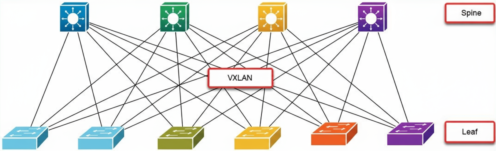

### Diagram: Figure 7.9 – Spine and leaf architecture

* **Spine Layer (Top Layer)**: The top row of switches is called the **spine switches** or backbone switches. Their job is to create a "full mesh." This mesh is formed by connecting every spine switch to *all* switches in the layer below.
* **Leaf Layer (Lower Layer)**: The switches in the lower layer are called the **leaf switches**.
* **Connection Rule**: Every leaf switch is connected to *every* spine switch. This creates a full mesh for redundancy (additional paths).

  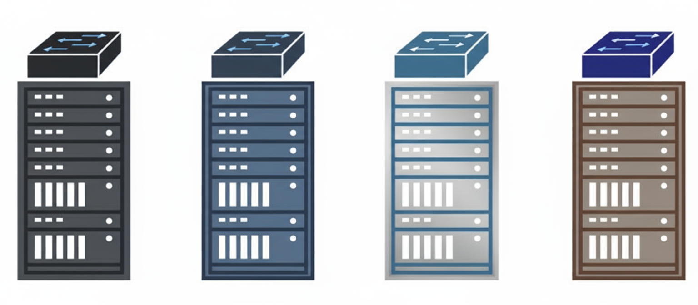

### Diagram: Figure 7.10 – Top-of-Rack switching

Leaf switches are also known as **Top-of-Rack (TOR)** switches.

* **Reason**: Because they are typically placed at the very **top** of a server rack and allow servers to connect to the network.
* **Function**: The diagram (Figure 7.10) shows that all physical servers within each physical server rack are connected to the TOR (leaf) switch of that *same* rack.

As shown in the diagram above, every server within a single rack is connected to that rack's TOR switch.

* **Intra-Rack Traffic (Inside the rack)**: Therefore, if a virtual machine (VM) on one server in Rack 1 wants to communicate with a virtual machine on another server *within* Rack 1, the TOR switch for Rack 1 will handle forwarding that traffic between the servers and virtual machines within Rack 1.

---

### 💡 Important Note

* **North-South Traffic**: This is the traffic flow that occurs between a server and the *outside* of the data center (like the internet).
* **East-West Traffic**: This is the traffic flow that occurs *between* servers and virtual machines *inside* the data center. (The Spine-Leaf design is excellent for this traffic).

---

  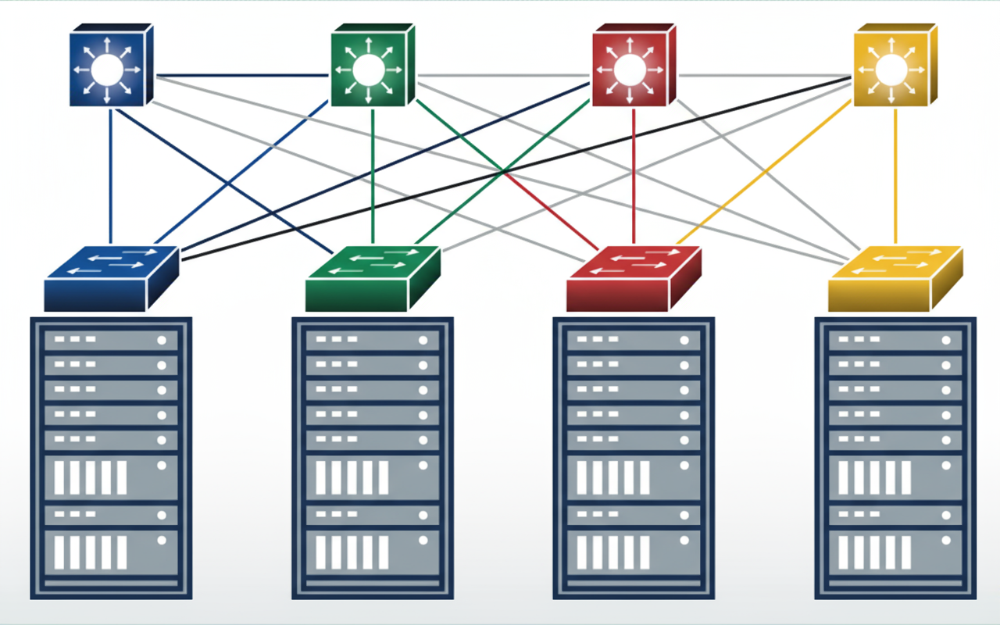

### Diagram: Figure 7.11 – Forwarding traffic between spine and leaf switches

However, if a virtual machine on a physical server in Rack 1... wants to communicate with a virtual machine on a physical server in Rack 3 (**Inter-Rack Traffic**), then:

1.  The TOR (leaf) switch for Rack 1 will forward that traffic to one of the **spine switches**.
2.  That spine switch will then forward the message to the TOR (leaf) switch for **Rack 3**.
3.  The TOR (leaf) switch for Rack 3 will be responsible for delivering that message to its destination virtual machine.

The diagram (Figure 7.11) shows how traffic is forwarded between the spine and leaf switches.

### Features of Spine-Leaf Architecture

* **Layer 3 Switches**: In a spine and leaf architecture, every switch (whether spine or leaf) is a **Layer 3 switch** (meaning it can also perform routing).
* **Routing Protocols**: This architecture uses dynamic routing protocols (like OSPF or BGP) to forward traffic between servers and devices.
* **VXLAN Technology**: This architecture uses a technology called **Virtual Extensible LAN (VXLAN)**. This technology allows data centers to easily scale to meet the demands of providing cloud computing services to users.

### Scalability (Ability to Expand)

As more server racks are implemented in the data center, the spine and leaf architecture allows data center engineers to easily scale (expand) the network to support more devices.

* **Adding Leafs**: Adding an additional leaf switch allows more servers to be included in the data center network.
* **Adding Spines**: Furthermore, it is also very easy to add additional spine switches to support the growing number of leaf switches.

---

# 📦 **Storage Area Networks** (SANs)

Data is the most valuable asset for any organization and must be safeguarded at all times from threat actors, such as hackers.

While cybersecurity professionals continuously work to ensure their organization's assets are secure, it is also crucial to consider that data-storing devices can experience **hardware failures**. These failures can occur in:

* Hard Disk Drives (HDDs)
* Solid State Drives (SSDs)
* Drives within computers, servers, or Network Attached Storage (NAS) devices.

---

## ⛔ The Problem of Lacking Centralized Storage

Imagine an organization that has no centralized file server on its network. In this scenario, everyone stores their essential files on their **local computers**.

Whenever a user needs to share a document with another person, they send it as an email attachment. If a user's computer becomes infected with malware or experiences a hardware failure, there is a significant risk that all data on the local device will be **lost**.

---

## 1️⃣ Solution 1: Network Attached Storage (NAS)

An organization can implement **Network Attached Storage (NAS)** devices on its Local Area Network (LAN).

* **Objective**: A NAS allows users to centrally store files on a **dedicated device** over a TCP/IP network.
* **What It Is**: As the name suggests, a NAS is a small enclosure containing several HDDs (hard drives) that work as a cluster.
* **Benefit**: It permits users on the network to access this storage unit via the computer network.
* **Best Use Case**: NAS devices are highly efficient for **small networks** with only a few users. This helps the company save money while still providing a dedicated and centralized storage device.

---

## 2️⃣ Solution 2: Storage Area Network (SAN)

If an organization is performing well and **expanding**, more employees will be hired. This means more users and devices will be added to the network.

### NAS Limitations
In a large organization, where **hundreds or thousands** of users are continuously transferring files over the network, NAS devices are no longer efficient (they cannot handle such a heavy load).

### The SAN Solution
For this, dedicated storage servers with a large number of storage drives are necessary. These drives are configured using **RAID (Redundant Array of Independent Disks)** to provide redundancy among the server's storage drives. The benefit of this is that even if one storage drive inside the server fails, no data is lost.

Organizations that have the necessary resources will invest in creating a **Storage Area Network (SAN)**.

* **What is a SAN?**: A SAN provides a **dedicated, high-speed network** that interconnects all the data storage pools of servers and devices.
* **Purpose of a SAN**: The fundamental concept of a SAN is to ensure two things:
    1.  **High-speed access** between users and the dedicated storage servers.
    2.  **Maximum availability** by implementing fault tolerance and redundancy within the SAN's storage devices and applications.

  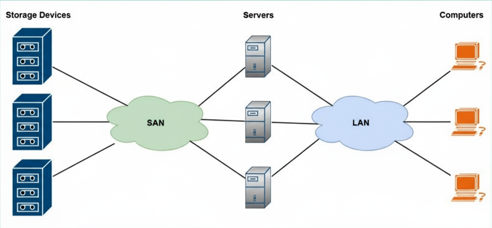

## 📊 Diagram Explanation (Figure 7.12)

The diagram below illustrates a typical SAN design.

As shown in the diagram:

* **Storage Devices**: These are the dedicated **disk arrays** (where data is saved). These devices are connected directly to the SAN (represented as a green cloud).
* **Servers**: The servers are in the middle. They connect to the **SAN** to store and retrieve data, and they connect to the **LAN** (blue cloud) to provide that data to the users.
* **Users**: Regular users (computers) connect **only to the LAN** and access data *through* the servers.

---

## 🛠️ Technology

### Fiber Channel
The SAN network typically uses **Fiber Channel** technology. This provides extremely high-speed connections to support high data rates between the file servers and (via the servers) the organization's users.

### SAN Switches
A SAN has its own dedicated networking devices known as **SAN switches**. These switches interconnect the storage servers and are responsible for moving (forwarding) network data *within* the SAN. (These are separate from and much faster than standard LAN switches).

## ⚡ High-Speed Connection Types in Storage Area Networks (SANs)

Because a Storage Area Network (SAN) supports numerous storage devices and servers, it is essential to support the necessary high bandwidth (high-speed connection) between the SAN and the rest of the organization's users.

In a modern networking environment, including Software-Defined Networking (SDN), these are the different components used:

## 🚀 Fiber Channel (FC)

Fiber Channel (FC) is an extremely high-speed network. It is specifically designed for two things: very **low latency** (i.e., very fast response times) and **high throughput** (transferring a large amount of data at once).

Using FC in a SAN has many advantages compared to traditional copper cables:

* **Distance**: Network professionals can run fiber cables far beyond the 100-meter limit of copper.
* **Speed**: It transfers data at gigabit speeds, unlike copper cables which begin to suffer from **attenuation** (signal loss or weakening) after a certain distance. This is not an issue for fiber.
* **Implementation**: When FC is implemented in a network, an **FC Host Bus Adapter (HBA)** is installed on every storage server and networking device within the SAN. Each HBA has multiple ports for data exchange.

## 📦 Fiber Channel over Ethernet (FCoE)

Fiber Channel over Ethernet (FCoE) is a method that allows FC frames (data packets) to be **encapsulated** (wrapped inside) an Ethernet message so it can be transported over the network.

* **Objective**: The purpose of using Ethernet is to provide a mutual (common) technology on the network. This technology can simultaneously deliver various types of traffic—such as FC storage traffic and regular Internet Protocol (IP) traffic—together over high-speed fiber optic cables.
* **Limitation**: Typically, access to network resources via FCoE is limited to a single **LAN (Local Area Network)**.

## 🌐 Internet Small Computer Systems Interface (iSCSI)

Unlike FCoE, iSCSI provides fiber communication over a **routable network** (meaning it can operate between different networks).

* **Simple Explanation**: Put simply, if an organization's users are located on different IP networks (different locations or subnets), then iSCSI is a better solution.
* **Comparison**: iSCSI is **routable**, whereas FCoE only grants access to users who are on the same network (LAN).

---

# ☁️ **Fundamental Principles of Cloud Computing**

Cloud Computing is currently one of the most in-demand and trending topics within the IT industry. This is primarily because an increasing number of organizations are migrating their services, applications, and servers to the cloud.

In the journey to become a network professional, it is essential to have a strong understanding of cloud computing, its various deployment models, and the services it offers.

## What is Cloud Computing?

In simple terms, cloud computing can be defined as the practice of paying to use resources located in a cloud service provider's data center, such as those operated by **Amazon** or **Microsoft**.

---

### The Traditional Method

Imagine your organization needs additional servers to host new applications and services for daily employee tasks. The concerns associated with acquiring new servers include:

* **Time (Shipping):** The duration it takes for the vendor to deliver the servers to the customer's location.
* **Time (Setup):** The duration it takes for IT staff to set up those servers and deploy applications on them.
* **Maintenance:** Separate maintenance is required for any future issues that arise with the equipment.

### The Cloud Solution

What if your organization could pay for resources *only as you use them*—resources that reside in someone else's data center, such as **Microsoft Azure**, **Amazon Web Services (AWS)**, or **Google Cloud Platform (GCP)**?

In simple terms:

1.  Your organization creates a user account on the cloud service provider's website.
2.  It selects the services as needed.
3.  It estimates the cost of hosting those services using an online calculator.
4.  And then, it deploys servers and services **in minutes** instead of weeks.

That is correct—instead of waiting weeks to receive physical servers from a vendor, cloud computing allows professionals to deploy new servers and applications over the internet in just a few minutes.

Furthermore, if an individual no longer wishes to use a service, application, or server in the cloud provider's data center, you can **terminate** it within seconds and immediately stop paying for it.

---

## 💸 Pay-As-You-Go Model

Cloud computing providers allow their customers to use a **"pay-as-you-go"** model. This means you can pay per minute or per hour, depending on the provider.

* **Benefit:** This helps organizations save a significant amount of money and time, as they can start and stop servers according to their needs.
* **Most Important Benefit:** The customer is **not responsible** for handling the physical maintenance of the servers located in the cloud service provider's data center. This responsibility is lifted from your IT staff.
* **Customer's Responsibility:** However, the customer **is responsible** for the security management of all services, applications, and servers that are deployed in the cloud provider's data center.

For this reason, cloud engineers must have a strong understanding of security concepts and best practices to secure data and assets in the cloud.

---

## What Does the Word "Cloud" Mean? ☁️

The word "cloud" simply means that the customer is using a service, application, or server that resides in a data center that the customer can neither see nor physically access.

For example, anyone on the internet with a credit card can create a user account on Microsoft Azure, AWS, or GCP and deploy a server within minutes. But do you, as the customer, see the physical server in that data center?

In simple terms, in most cases, you do not see the actual servers, but you can communicate with that server using the internet. (The internet itself is a collection of public networks managed by many different ISPs around the world).

---

## 🚀 Advantages of Cloud Computing

There are many advantages to using cloud computing technologies, such as the resources in the cloud provider's data center being **accessible from anywhere at any time**.

### Example: Email Services

Services like **Google Workspace** and **Microsoft 365** allow companies to outsource their email services to the cloud solutions provided by Google and Microsoft.

* **Benefit:** By using Google Workspace and Microsoft 365, a company eliminates the need to set up mail exchange servers within its own network.
* **Model:** Utilizing these email solutions, a company pays only **per user per month**. If a user requires additional storage for their mailbox, the company pays just an additional fee for that specific user.
* **Result:** Overall, all users can access their mailbox (email inbox) from anywhere at any time using an internet connection, because these services are hosted and maintained by the email solution provider (Google/Microsoft).

---

## Reducing and Scaling Resources

Cloud computing helps companies reduce the need for physical appliances, equipment, and devices at their own location. In simple terms, this reduces the physical space required to house servers.

Cloud providers allow their customers to quickly **"spin up"** (create) a new virtual server in the cloud within minutes. Concurrently, they also permit the customer to **scale up** (increase) or **scale down** (decrease) computing resources on the server.

* **Scaling Up (Increasing):** As a virtual server on the cloud requires more computing power, the customer is provided with features to increase computing resources. For example:
    * Increasing the number of virtual processors (vCPUs).
    * Increasing memory, i.e., virtual RAM.
    * Increasing storage drives.
    * Increasing Network Interface Cards (NICs).
* **Scaling Down (Decreasing):** This is the opposite of "scaling up." When demand is low, the computing resources on the server are reduced.

---

## Impact on IT Jobs

Organizations that utilize cloud computing technologies reduce the need for a dedicated IT team (which traditionally managed hardware).

However, despite this, there is a **huge demand** for cloud engineers who possess the specialized skills to deploy, maintain, and secure solutions on Microsoft Azure, AWS, and GCP.

These three (3) top cloud providers have created their own learning paths and certification tracks to help the new generation of IT professionals learn cloud computing.

---

## 💡 Important Note

* **Tenant:** A single customer on a cloud provider's platform (a single 'renter').
* **Multi-tenant:** When multiple customers use the same cloud provider's platform (shared resources).
* **Tenant Isolation:** This is used in multi-tenancy. It allows many customers to use the same shared resources within the data center, but each customer remains **isolated** from other customers' resources (no one can see another's data).

---

## ⚖️ Elasticity and Scalability

Cloud computing providers support both **elasticity** and **scalability**.

### 1. Elasticity

Elasticity simply means that a system **adapts** itself according to changes in workload and environment.

This allows the customer to quickly **provision** (create) and **de-provision** (terminate) servers and applications in the cloud provider's data center as needed.

* **Example:** Assume your organization needs one (1) web application to host a website. As more users connect to your web server, the demand for computing power to process each web request will increase.
* **Role of Elasticity:** With elasticity, your organization can create **additional** web servers in minutes for that same web application and implement a **load balancer** to distribute the incoming web requests among every web server.

### 2. Scalability

Scalability in cloud computing allows organizations to **increase** or **decrease** necessary resources based on demand.

* **Example:** You might need one (1) Linux server in the cloud to perform certain tasks. As you increase the workload on the server, you will eventually notice that each task is taking longer to complete.
* **Role of Scalability:** By increasing this server's virtual number of processes (vCPUs) and memory (RAM) (i.e., **"Scaling Up"** the server), more tasks can be run at the same time, and it will be ensured that each process receives adequate computing resources.

---

## 🔒 Security: A Shared Concern

In a cloud computing environment, the **customer is responsible** for the security of the resources that they place in the cloud service provider's data center.

* **Example:** If you "spin up" a new virtual server that is running Windows Server 2022 or a Linux-based server, **you are responsible** for securing your virtual machine on the cloud.
* **Risk:** Therefore, if you do not apply device hardening techniques and best practices to that virtual server, there is a **very high risk** that a threat actor (such as a hacker) could compromise your virtual server over the internet.

---

# ☁️ **Cloud Deployment Models**

When a cloud computing solution is deployed for an organization, cloud engineers and service providers typically use four (4) models.

---

### 1. Private Cloud 🏢

The private cloud model is one where an organization (such as your company) **owns its own data center**, and that infrastructure is managed by your own IT team.

Within the private cloud model, access to resources is restricted **only to that organization's employees** and no one else.

  

The diagram below (Figure 7.13) illustrates a private cloud model that can only be accessed by the organization and its employees:

**Figure 7.13 – Private cloud model**

---

### 2. Public Cloud 🌐

The public cloud model is available to **anyone** on the internet. These include public cloud service providers such as:

* Microsoft Azure
* Amazon Web Services (AWS)
* Google Cloud Platform (GCP) and many others.

The public cloud allows everyone to create virtual servers and deploy applications and services on a data center that **shares its resources** with others and uses a **pay-as-you-go** model.

In the public cloud model, the cloud service provider is responsible for the maintenance of all physical hardware.

  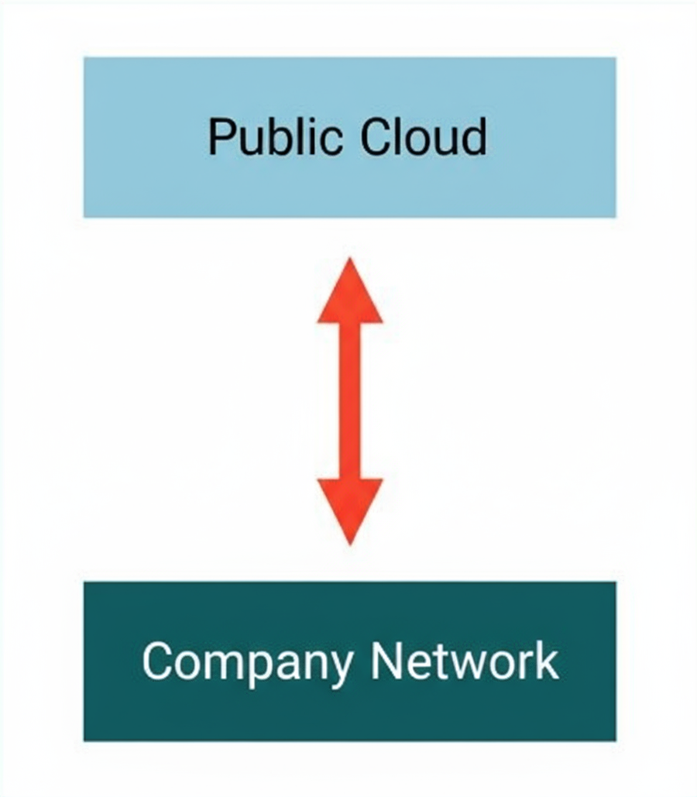

The diagram below (Figure 7.14) shows the public cloud and your organization, which is sharing resources with others:

**Figure 7.14 – Public cloud model**

---

### 3. Hybrid Cloud 🔄

The hybrid cloud model is a **mixture (hybrid)** of the private and public cloud deployment models.

It allows an organization to have its data, servers, and applications backed up locally in its own private data center and simultaneously **replicated** (copied) to an online public cloud solution provider.

This solution is quite **costly** to maintain, but it provides an **excellent solution for disaster recovery** and **business continuity**.

  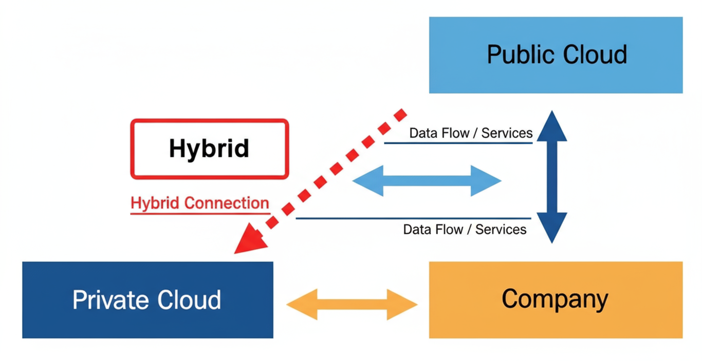

The diagram below (Figure 7.15) shows a hybrid cloud deployment model:

**Figure 7.15 – Hybrid cloud model**

---

### 4. Community Cloud 🤝

Finally, the community cloud model is one where **several organizations share resources** on a single cloud platform.

These can be groups of companies that have shared interests or partnerships, all accessing and sharing resources within the same data center or from the same cloud service provider.

---

## 📦 Cloud Service Models

Different cloud service models define how services, applications, and resources are **delivered** from the cloud service provider's data center to the users.

### 1. SaaS (Software-as-a-Service) 📧

SaaS is a very common service model. It allows the cloud solution provider to grant the user access **only to the application's user interface (UI)**, which is being hosted in the provider's data center.

* **Instance**: Organizations using Google Workspace or Microsoft 365 do not need to install a client application on each user's computer. Every user can easily access their corporate email and other collaboration tools' web application using a standard web browser.
* **User Concern**: The user neither worries about nor has access to manage the host operating system (OS) or the hardware components of the servers that are hosting the application.

### 2. PaaS (Platform-as-a-Service) 💻

The PaaS service model is specifically designed for **developers** who require a bit more control over their operating or working environments.

* **Control**: When working with a PaaS solution, the cloud service provider allows the user or developer to make **changes to the operating system (OS)** and the programming frameworks (running on the OS).
* **Limitation**: However, the user does not have access to the server's **underlying hardware resources**.

### 3. IaaS (Infrastructure-as-a-Service) 🛠️

The IaaS service model allows the user to **manage the physical hardware and software resources** on a virtual server in the cloud provider's data center.

This model permits the user to **increase (scale up) or decrease (scale down)** computing resources on the servers, such as:

* Number of processes (vCPUs)
* Memory (RAM)
* Storage (Hard drive)
* Networking interface
* Operating system (OS)

### 4. DaaS (Desktop-as-a-Service) 🖥️

DaaS is where a cloud service provider can deliver a **virtual desktop environment** (a full desktop) to a user over the internet.

* **Provider's Responsibility**: The cloud service provider is responsible for managing all **backend maintenance**, such as hardware and software requirements. This includes backups, storage, and updates.
* **Shared Responsibility**: However, the security management of DaaS solutions can be a **shared responsibility** between the cloud service provider and the user.
* **Types of DaaS**:
    * **Persistent Desktop**: This **keeps** the user's data and any changes made. Therefore, the next time the user logs into the virtual desktop, everything is already there.
    * **Non-persistent Desktop**: In this, every time the user logs off from the virtual desktop, all data and settings are **cleared** from the system. Therefore, the next time the user logs on, they are presented with a completely clean virtual desktop environment.

### 5. IaC (Infrastructure as Code) 📜

Finally, the IaC model focuses on managing resources in the cloud service provider's data center (like servers, load balancers, and networking) **through code and scripts**, using the same versioning methods employed by DevOps engineers.

---

## 🔗 Cloud Connectivity Solutions

Hosting applications, servers, and other resources on a cloud service provider's data center is excellent, but ensuring your organization and users have **secure access** is critically important.

If you do not have secure access to the resources on your data center or the cloud provider's data center, it poses a **major security risk**. This is because a threat actor (like a hacker) could **intercept** the communication channel between your users and the resources on the cloud, obtaining sensitive and confidential information.

### 1. VPN (Virtual Private Network) 🔒

A VPN allows for establishing a **secure, encrypted connection** over an unsecure network (such as the internet).

Setting up a VPN between your organization's network and the resources on the cloud service provider's data center is a **common solution** used by many organizations.

* **Benefit**: Using a VPN allows a company to save a significant amount of money and also secures **data-in-motion** (data that is traveling) over the internet.
* **Responsibility**: However, the company will be responsible for **managing its own VPN solutions** and ensuring that users can access resources when needed.

### 2. Private-Direct Connection 🔌

Another method to connect to the cloud service provider's data center is by using a **private-direct connection** to the cloud provider.

Many ISPs (Internet Service Providers) offer **direct connectivity solutions** between an organization (the customer) and a data center. These connectivity solutions are typically **secure within the ISP network** to ensure that no unauthorized party can intercept the communication channel between the customer and the data center.

---