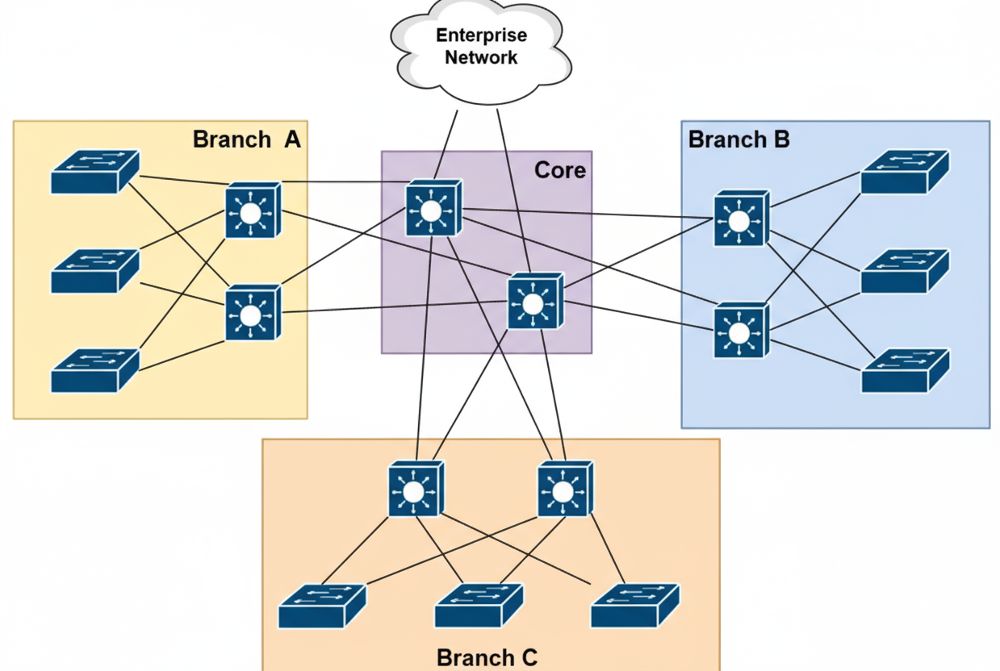

# 💎 **Core Principles of Network Architecture**

This guide provides a comprehensive overview of designing an optimal network architecture, a foundational requirement for any modern organization.

---

## 💡 The Importance of Network Architecture

Designing an optimal network architecture is a critical task for any organization. This process extends far beyond simply purchasing new cables and devices; it is fundamentally about establishing a correct and robust foundation for all network operations.

When an organization experiences issues like **network congestion**, **high latency** (slow speeds), and **security vulnerabilities**, the root cause is often a poor network design. If the foundational design is flawed, adding new or expensive devices will not resolve these underlying problems.

A high-quality design ensures the network delivers:

* **High Performance:** Data travels quickly and efficiently.
* **Robust Security:** The network is protected from cyberattacks.
* **Future Growth:** The network can expand to meet new demands.

---

## 🚦 Common Network Performance Challenges

Two of the most common issues stemming from poor design are congestion and latency.

### Congestion

**Congestion** occurs when a network link (such as a cable or path) attempts to handle more data (traffic) than it has the capacity for. This is identical to a traffic jam on a road during rush hour.

* **Cause:** Congestion happens when too many devices try to send data simultaneously, and the network devices (like routers and switches) cannot process this volume of data quickly enough.
* **Effect:** Congestion forces data packets to wait in a queue. This waiting period slows down packet speed, and in severe cases, some packets are **discarded** (lost). This process significantly reduces network reliability.

### High Latency 🐢

**Latency** is the total time it takes for a data packet to travel from its source to its destination and return (known as the **Round Trip Time**). When this time is excessive, it is called **High Latency**.

* **Cause:** The most significant cause of high latency is network congestion. When packets must wait in line due to traffic, their latency naturally increases. Other causes can include data traveling very long physical distances or failing network equipment.
* **Effect:** Users experience high latency as slow response times. For example:
    * Web pages take a long time to load.
    * Online games suffer from "lag" or stuttering.
    * Video calls freeze or buffer.

### The Critical Relationship 🔗

**Congestion is the primary cause of high latency.** When traffic on the network increases to the point of congestion, the resulting packet delays directly increase latency. Both of these issues are detrimental to achieving high network performance and a good Quality of Service (QoS).

---

## 🛠️ The Four Pillars of Network Design

When designing a network, you must consider four fundamental factors to prevent the issues above and build a robust system.

### 1. Fault Tolerance and Redundancy 🛡️

**Fault tolerance** is a principle ensuring that your network can continue to operate and provide services even if a component fails.

Its goal is to ensure that if any network device (like a router or switch) or a cable fails, the network can:
1.  Quickly identify the failure.
2.  Reroute traffic through an alternate path.

This prevents any interruption in communication for users and maintains high network **availability**.

Network professionals achieve fault tolerance by implementing **redundancy**.

* **What is Redundancy?** Redundancy simply means creating more than one path (multiple paths) for data packets to travel between a source and a destination.
* **How it Works:** If one path fails (e.g., a router goes offline ❌), the network devices immediately detect this failure. They then automatically reroute the traffic through the remaining healthy paths (as shown by the green arrow ➡️) to ensure the data still reaches its destination.

  

#### The Role of Packet Switching 📦

Most modern networks use **packet switching** to send data.

1.  **Message Division:** When you send a message (like an email), the sending device divides it into small pieces called **packets**.
2.  **Independent Travel:** Each packet contains the destination address. In a packet-switched network, it is not necessary for all packets to follow the same route.
3.  **Best Path:** Each packet can individually choose the best path available at that moment, based on current network conditions like traffic (congestion) and speed.

Fault tolerance and redundancy make packet switching even more effective. If one path fails, packets can instantly be routed to another available path, making the message delivery highly reliable.

### 2. Scalability 🚀

**Scalability** is a critical part of network design. It means designing the network in a way that allows it to easily support the organization's growth. This includes adding new devices, new users, and new applications without negatively impacting the network's performance.

As a company expands and hires new employees, the number of devices on the network (computers, laptops, smart devices) increases. Network professionals must add new switches to connect these devices.

If the original network design is not scalable, adding new devices will cause significant problems or degrade the performance of existing services.

#### The "Daisy Chain" Connection: A Non-Scalable Example ⛓️

A **daisy chain** is a method where devices are connected in a linear series: one switch is connected to the next, which is connected to the next, forming a long chain.

* **Function:** This method *does* provide end-to-end connectivity.
* **Problem:** This design is terrible for both scalability and redundancy.

**Disadvantages of Daisy-Chaining ⚠️**

1.  **Lack of Fault Tolerance:** If any single switch in the chain fails (especially one in the middle), all devices "downstream" from that switch will lose their network connection. The network becomes severely impacted by a single point of failure.
2.  **Performance Issues:** When traffic needs to travel from one end of the chain to the other, it must pass through every single intermediate switch. This long journey significantly increases latency and creates a high risk of congestion.

For these reasons, daisy-chaining switches is **not recommended** as it leads to long-term problems. A proper, scalable design, such as a **star topology** (where all switches connect to a central distribution switch), is preferred.

  

### 3. Security 🔒

Network security is the most critical priority for every organization today, regardless of its industry. With the rise of sophisticated cyberattacks, organizations must protect their data and assets from threats like hackers.

The fundamental goal of security in network design is to protect assets and **mitigate risks**. Without security solutions, network professionals might not even know *when* or *how* their network was compromised until it is too late.

Organizations must invest in a variety of layered security solutions:

* **Firewall Appliances:**
    * **Function:** A firewall acts as a door between the internal network and the outside world (the Internet).
    * **Purpose:** It filters data traffic, only allowing packets to enter or leave that comply with predefined security rules.
* **Intrusion Prevention Systems (IPSs):**
    * **Function:** An IPS continuously monitors all network traffic.
    * **Purpose:** If it detects any
        suspicious or malicious activity (an "intrusion"), it immediately blocks that activity to prevent any damage from occurring.
* **Endpoint Security Solutions:**
    * **Function:** These solutions are installed directly on each end device (e.g., computer, laptop, or server).
    * **Purpose:** They protect the individual devices from viruses, malware, and other local threats.

**Benefits of Investing in Security**

1.  **Rapid Detection:** It reduces the **"time to detect an intrusion."** The moment a hacker enters the network, the security system can identify and flag them.
2.  **Continuous Protection:** Security solutions are constantly evolving, providing cybersecurity professionals with the necessary tools to defend against new and emerging threats.

In simple terms, a strong network security design is like an insurance policy for the organization, protecting its business operations and data.

### 4. Quality of Service (QoS) 🎯

**Quality of Service (QoS)** is a technology that allows network professionals to give **priority** to specific types of data traffic. This ensures that essential services continue to function perfectly, even when the network is experiencing congestion.

Different types of data have different needs:

* **TCP (Transmission Control Protocol):** Most applications (like email and web browsing) use TCP because it provides **guaranteed delivery**. If a packet is dropped, TCP ensures it is sent again.
* **UDP (User Datagram Protocol):** Time-sensitive applications (like **VoIP - Voice over IP** and **Video over IP**) use UDP. It is much faster but does **not** guarantee delivery.

**The Problem:** During network congestion, UDP messages are the most likely to be dropped. Voice and video calls must happen in **real-time**. If their packets are dropped, parts of the conversation are simply lost, which destroys the user experience.

**The QoS Solution:** QoS mechanisms configure routers and switches to:
1.  **Identify** high-priority traffic (like VoIP and Video).
2.  **Reserve** bandwidth for that traffic.
3.  **Prioritize** it over other, less time-sensitive traffic (like file downloads or email).

This way, even during heavy network congestion, essential data reaches its destination quickly and with low latency.

---

# 🚀 **Cisco's 3-Tier Network Architecture**

Cisco's 3-Tier Architecture is a common and highly effective network design approach utilized by large organizations. In this design, the network is segmented into three distinct layers, with each layer performing a specific function. This design simplifies the network and makes it easier to manage.

---

## 🏛️ The Layers of the 3-Tier Architecture

  

This architecture enhances scalability, fault tolerance, and security by separating the three layers.

### 1. Access Layer (Edge Layer) 🔌

* **Objective**: This layer connects end devices (such as computers and printers) to the network. It represents the "edge" of the network where users begin to access data.
* **Function**: It primarily operates at **Layer 2** (of the OSI Model), meaning it forwards data frames based on MAC addresses.
* **Redundancy**: Typically, end devices (like computers) have only one Network Interface Card (NIC). Therefore, their connectivity to the Access Layer switch usually does not include redundancy.

### 2. Distribution Layer (Aggregation Layer) 🔗

* **Objective**: This layer connects the Access Layer switches and provides redundancy for them. It aggregates the traffic received from the access layer and forwards it to the Core Layer.
* **Function**: It possesses **Layer 3** (Routing) capabilities. **Layer 3 Switches** are used at this layer, which perform routing (sending traffic between different subnets) and filtering (using access lists).
* **Redundancy**: Each Access Layer switch is connected to two different Distribution Layer switches. If one Distribution switch fails, the Access switch immediately redirects traffic to the other switch, thus maintaining fault tolerance.

### 3. Core Layer (Backbone) 🧠

* **Objective**: This is the backbone of the network. Its fundamental purpose is to transport data at high speeds.
* **Function**: Core Layer switches focus solely on high-speed switching and routing. They do not perform any complex filtering or policy enforcement. They are designed using **Layer 3 Switches**.
* **Traffic Flow**: All traffic coming from the Distribution Layer passes through the Core Layer to reach the Enterprise Network or other branches.

---

## 📌 Key Takeaway: Layer 3 Switches

It is essential to remember that **Layer 3 switches** are used in the Distribution and Core Layers. These switches can perform both Layer 2 (switching) and Layer 3 (routing) functions. This makes it easy to segment the network into different subnets and rapidly route traffic between them.

---

## 🌟 3-Tier Architecture: A Deeper Look

Cisco's 3-Tier Architecture provides a foundation that offers large organizations excellent scalability, fault tolerance, and redundancy. In this design, the network is divided into three separate layers, which is also known as a **modular design**.

  

### Core Layer (Network Backbone) 🧠

The Core Layer is the high-speed backbone of the network architecture.

* **Objective**: Its primary role is to transport data at high speeds and provide interconnectivity and redundancy for the distribution layers.
* **Function**: When traffic needs to be sent from one Branch Office to another (e.g., from Branch A to Branch B), that data passes through the Core Layer.
* **Redundancy**: Every Distribution Layer switch is connected to every switch in the Core Layer. This ensures that if a single switch or link in the Core Layer fails, traffic can immediately travel via an alternative path.

### Benefits of 3-Tier Architecture ✅

This architecture is ideal for large organizations because:

* **Modular Design**: The design is segmented into three layers. Each layer has its specific role, which maintains scalability (new devices can be added easily) and redundancy.
* **Consistency**: This design supports modularity, which makes it easy to replicate design elements and implement them across the entire organization.
* **Flat-Network Elimination**: It eliminates the old and weak flat-network design, which supports neither scalability nor redundancy.

---

## 🛒 Switch Selection (Cisco Products)

Since the functions of each layer are different, selecting the appropriate switch model for each layer is crucial.

* **Access Layer Switches (LAN Access)**: These switches are for connecting end devices.
    * *Examples*: Catalyst 9200/9300 Series.
* **Core and Distribution Layer Switches (LAN Core and Distribution)**: These are high-speed and high-redundancy switches.
    * *Examples*: Catalyst 9500/9600 Series.

**💡 Tip**: As a network professional, you should always visit the vendor's website (like Cisco) to read the datasheet. This helps you understand if a specific switch model (like the Nexus 9000 Series, which is for data centers) meets your network's requirements and feature needs.

---

## 🏢 2-Tier Architecture

While the 3-Tier Architecture is recommended for large organizations, it can be quite expensive for smaller organizations. Therefore, the **2-Tier Architecture** was designed for smaller organizations.

This design provides features similar to the 3-Tier Architecture (scalability, fault tolerance) but **combines the Distribution and Core Layers** to reduce costs.

---